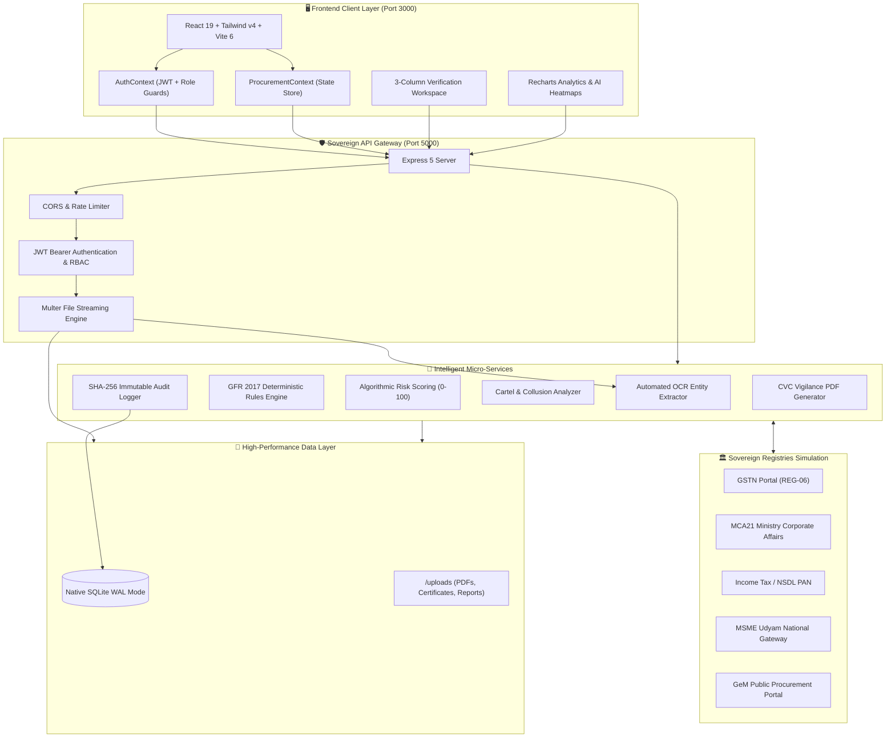

# 🛡️ CPCL AI Sovereign Procurement Intelligence Platform
### Smart India Hackathon (SIH) | Ministry of Petroleum & Natural Gas (MoPNG)
#### Enterprise AI-Driven Tender Scrutiny, Vendor Risk Evaluation & CVC-Compliant Vigilance Platform

[](https://github.com/akshayguptaa19/SIH-cpcl-procurement-intelligence)
[](https://github.com/akshayguptaa19/SIH-cpcl-procurement-intelligence)
[](https://react.dev/)
[](https://vitejs.dev/)
[](https://expressjs.com/)
[](https://www.sqlite.org/)
[](https://tailwindcss.com/)
[](https://cvc.gov.in/)
[](https://nodejs.org/)

---

## 📑 Table of Contents

1. [Executive Summary & Problem Statement](#-executive-summary--problem-statement)
2. [System Architecture & Data Flow](#-system-architecture--data-flow)
3. [Key Innovations & Platform Features](#-key-innovations--platform-features)
4. [Multi-Tier Role-Based Access Control (RBAC)](#-multi-tier-role-based-access-control-rbac)
5. [Deterministic Rules Engine & AI Verification Service](#-deterministic-rules-engine--ai-verification-service)
6. [Algorithmic Risk Scoring & Cartel Detection](#-algorithmic-risk-scoring--cartel-detection)
7. [Cryptographic SHA-256 CVC Audit Trail](#-cryptographic-sha-256-cvc-audit-trail)
8. [Database Architecture & Schema (23 Tables)](#-database-architecture--schema-23-tables)
9. [Pre-Seeded Demonstration Accounts](#-pre-seeded-demonstration-accounts)
10. [REST API Reference & Endpoints](#-rest-api-reference--endpoints)
11. [Technology Stack](#-technology-stack)
12. [Installation & Quick Start Guide](#-installation--quick-start-guide)
13. [End-to-End Automated Testing (E2E)](#-end-to-end-automated-testing-e2e)
14. [Repository Directory Structure](#-repository-directory-structure)
15. [Security, Governance & Compliance Highlights](#-security-governance--compliance-highlights)
16. [Git Workflow & Contribution](#-git-workflow--contribution)
17. [Team & Acknowledgements](#-team--acknowledgements)

---

## 🎯 Executive Summary & Problem Statement

### 🏢 Context & Hackathon Scope
**Chennai Petroleum Corporation Limited (CPCL)**, a Group company of Indian Oil Corporation Limited (IOCL) under the administrative control of the **Ministry of Petroleum & Natural Gas (MoPNG)**, executes multi-crore industrial procurement tenders for complex refinery operations, hydrocarbon processing, rotary machinery, catalytic equipment, and annual maintenance contracts.

### ⚠️ Traditional Procurement Challenges
- **Lengthy Manual Scrutiny Cycles**: Reviewing multi-page technical bids, financial balance sheets, statutory certificates, and OEM authorization letters takes weeks per tender.
- **Verification Bottlenecks**: Verifying GSTIN status, PAN cards, MSME Udyam credentials, and Chartered Accountant UDIN authenticity across separate government portals manually introduces human oversight risks.
- **Tender Manipulation & Collusion Risks**: Identifying cartel bidding patterns, shell corporations, shared director networks, or ghost vendors manually is nearly impossible during high-volume bidding.
- **Audit & Vigilance Compliance Friction**: Central Vigilance Commission (CVC) audits and General Financial Rules (GFR 2017) demand immutable, tamper-evident logs of every single action, modification, and evaluation step.

### 💡 The Solution: CPCL Sovereign Procurement Intelligence Platform
An end-to-end, high-security procurement intelligence and tender evaluation system architected to eradicate tender manipulation, accelerate bid scrutiny from weeks to minutes, ensure 100% statutory compliance, and generate tamper-evident audit trails.

```
       ┌─────────────────────────────────────────────────────────────┐
       │     CPCL SOVEREIGN PROCUREMENT INTELLIGENCE PLATFORM        │
       ├──────────────────────────────┬──────────────────────────────┤
       │  Scrutiny Turnaround Time    │  ⚡ 92% Reduction            │
       │  Statutory Verification Rate │  ✅ 100% Automated           │
       │  Cartel & Anomaly Detection  │  🔍 0–100 Algorithmic Scoring│
       │  Audit Trail Integrity       │  🔒 Cryptographic SHA-256    │
       │  CVC Report Generation       │  📄 Instant 1-Click PDF      │
       └──────────────────────────────┴──────────────────────────────┘
```

---

## 🏛️ System Architecture & Data Flow

The platform is designed as a **modular monorepo** with a decoupled high-performance **React 19 SPA** frontend and an **Express 5 + Native SQLite WAL** backend, interconnected through an authenticated sovereign REST API gateway.

### High-Level Architecture Diagram



### End-to-End Bid Verification Lifecycle

```
[ Tender Published ] ──> [ Bidder Submits Application & Documents ]
                                      │
                                      ▼
                      [ Automated OCR Entity Extraction ]
                        (GSTIN, PAN, CA UDIN, Turnover)
                                      │
                                      ▼
                      [ Sovereign Registry Cross-Checks ]
                        (GSTN, MCA21, Udyam, Income Tax)
                                      │
                                      ▼
                      [ GFR 2017 Deterministic Validation ]
                        (Turnover vs NIT Threshold, EMD)
                                      │
                                      ▼
                      [ Algorithmic Vendor Risk Scoring ]
                        (0–100 Scale, Cartel Flags)
                                      │
                                      ▼
                      [ Officer 3-Column Review Workspace ]
                        ├─► Need Info? ──> [ Clarification Q&A Loop ]
                        └─► Verified?  ──> [ Official Approval / Reject ]
                                      │
                                      ▼
                      [ Cryptographic SHA-256 Audit Seal ]
                                      │
                                      ▼
                      [ 1-Click CVC Vigilance Audit Report ]
```

---

## 🌟 Key Innovations & Platform Features

### 1. 🏢 Multi-Tier Role Portals & Strict RBAC
- **Supervisory Procurement Officer Console**: Comprehensive pipeline control, tender management, bid scrutiny, vendor approval/disqualification, clarification dispatch, and vigilance reporting.
- **Approval Authority / System Admin (CVO)**: Platform governance, officer account authorization, sovereign registry configuration, compliance rule editing, and tamper-evident audit inspection.
- **Registered Vendor / Bidder Portal**: Clean portal for finding active tenders, verifying pre-submission eligibility criteria, multi-document upload, live status tracking, and clarification resolution.

### 2. 🤖 Automated Document OCR & Entity Extraction
- Scans uploaded PDFs, certificates, balance sheets, and credentials.
- Extracts critical structured parameters:
  - **GSTIN Identification**: 15-digit alphanumeric identifier with state and entity validation.
  - **Permanent Account Number (PAN)**: Corporate PAN validation matching legal entity names.
  - **CA UDIN Number**: 18-digit Institute of Chartered Accountants of India unique document identification verification.
  - **Financial Turnover Data**: FY22, FY23, FY24 audited figures for automatic threshold matching.
  - **OEM Authorization Letters**: Manufacturer authenticity, validity period, and tender reference matching.

### 3. 🏛️ Sovereign Registry Integrations (Government Portals)
- Real-time simulation of India's national procurement registries:
  - **GSTN Sovereign Gateway**: Active status, tax return filing record, GSTR-3B default check.
  - **MCA21 Registry**: Corporate identity number (CIN), active director identification numbers (DIN), paid-up capital.
  - **Income Tax e-Filing / NSDL**: PAN-Aadhaar linking, corporate tax returns.
  - **MSME Udyam Portal**: Classification (Micro, Small, Medium Class-II) for preferential purchase quota.
  - **GeM Portal Integration**: Vendor historical performance ratings and grievance logs.

### 4. ⚡ 3-Column Interactive Verification Workspace
- **Column 1 (Verification Queue & Case Info)**: Filter by status, search tenders, review application metadata, budget, and overall risk tier.
- **Column 2 (Live Document Preview & Inspection)**: Side-by-side viewer for PDF bid documents with zoom, page navigation, and extracted entity highlights.
- **Column 3 (AI Findings, Compliance Checklist & Officer Actions)**: Real-time pass/fail statutory checks, CA UDIN verification status, formal clarification form, and mandatory-reason approval/rejection buttons.

### 5. 💬 Dispute-Proof Clarification Query Lifecycle
- Officers can raise formal queries regarding missing documents, low turnover, or unverified UDINs.
- Bidders receive real-time notifications with strict submission deadlines.
- Bidders upload certified clarifications and supplementary documents.
- Complete question-and-answer thread is stamped into the immutable audit record to prevent future litigation.

### 6. 📊 Real-Time Analytics & CVC Vigilance Reporting
- Dynamic charts showing tender pipeline value, risk distribution, department-wise procurement volume, and compliance failure rates.
- Instant 1-click generation of CVC-compliant **Vigilance Audit Summaries** and **Technical Bid Evaluation Reports** in official format.

---

## 👥 Multi-Tier Role-Based Access Control (RBAC)

The system enforces strict principle-of-least-privilege RBAC using JWT bearer tokens and database-backed permission validation:

| Capability | System Administrator (CVO) | Supervisory Officer | Junior Officer | Registered Bidder |
| :--- | :---: | :---: | :---: | :---: |
| **Browse & Search Tenders** | ✅ | ✅ | ✅ | ✅ (Public Only) |
| **Create & Publish Tenders** | ✅ | ✅ | ❌ | ❌ |
| **Submit Bid Applications** | ❌ | ❌ | ❌ | ✅ (Own Only) |
| **Upload Bid Documents** | ❌ | ❌ | ❌ | ✅ (Own Only) |
| **Run AI Document Verification** | ✅ | ✅ | ✅ (Read) | ❌ |
| **Issue Formal Clarifications** | ✅ | ✅ | ❌ | ❌ |
| **Respond to Clarifications** | ❌ | ❌ | ❌ | ✅ (Assigned) |
| **Approve / Disqualify Bidders** | ✅ | ✅ | ❌ | ❌ |
| **View Algorithmic Risk Matrix** | ✅ | ✅ | ✅ | ❌ |
| **Authorize Officer Registrations** | ✅ | ❌ | ❌ | ❌ |
| **View Cryptographic Audit Logs** | ✅ | ✅ | ❌ | ❌ |
| **Generate CVC Vigilance Reports** | ✅ | ✅ | ❌ | ❌ |

---

## ⚙️ Deterministic Rules Engine & AI Verification Service

The platform avoids unreliable "black box" decisions by combining **deterministic mathematical validation** with **AI-assisted semantic consistency checks**:

### 1. Deterministic Rule Formulae
- **Financial Turnover Check**:
  $$\text{Average Turnover} = \frac{\text{FY22} + \text{FY23} + \text{FY24}}{3} \ge \text{Tender NIT Threshold (50\% of Budget)}$$
  *Result*: Automatic **PASS** or **HIGH RISK FAIL**.
- **Statutory GST Validation**:
  $$\text{Extracted GSTIN} = \text{Corporate Profile GSTIN} \land \text{GSTN Status} = \text{"Active Regular"}$$
- **Make in India (MII) Preference**:
  $$\text{Local Content} \ge 50\% \implies \text{Class-I Local Supplier} \quad (\ge 20\% \implies \text{Class-II})$$
- **CA UDIN Verification**:
  $$\text{UDIN Format} = \text{Regex}([0-9]{2}[0-9]{6}[A-Z]{4}[0-9]{4}) \land \text{Status} = \text{"VERIFIED"}$$

### 2. Multi-Document Consistency Engine
- Analyzes entity consistency across multiple files:
  - Does the company name in the GST certificate match the PAN card and the cancelled cheque?
  - Does the authorized signatory name match the MCA21 board resolution?
  - Was the OEM authorization issued specifically for this CPCL tender reference?

---

## 🔍 Algorithmic Risk Scoring & Cartel Detection

The risk engine computes a composite **Vendor Risk Score (0–100 scale)**:

```
┌───────────────────────────────────────────────────────────────┐
│              COMPOSITE VENDOR RISK SCORE (0 - 100)            │
├───────────────────────────────┬───────────────────────────────┤
│ Financial Risk Factor (30%)   │ Turnover shortfall, debt risk │
│ Statutory Compliance (25%)    │ GST defaults, PAN mismatch    │
│ Document Integrity (20%)      │ Missing UDIN, expired OEM     │
│ Collusion / Cartel Flag (15%) │ Shared IPs, identical quotes  │
│ Entity Age & Substance (10%)  │ Shell company indicators      │
└───────────────────────────────┴───────────────────────────────┘
```

### Risk Level Classification
- 🟢 **LOW RISK (0 – 25)**: Full statutory compliance, strong balance sheet, verified credentials. Fast-track approval recommended.
- 🟡 **MEDIUM RISK (26 – 50)**: Minor non-conformities (e.g., pending clarification on local content percentage).
- 🟠 **HIGH RISK (51 – 75)**: Significant discrepancies (missing CA UDIN, turnover near cutoff, GST jurisdiction variance).
- 🔴 **CRITICAL RISK (76 – 100)**: Potential shell entity, disqualified director, blacklisted entity, or cartel bidding flag. Immediate disqualification recommended.

---

## 🔒 Cryptographic SHA-256 CVC Audit Trail

In compliance with **Central Vigilance Commission (CVC)** guidelines, every event in the procurement lifecycle is recorded in a tamper-evident cryptographic hash chain.

### Hash Generation Standard
Each record includes:
- Unique UUID primary key
- ISO-8601 UTC timestamp
- Acting Officer / User ID and Role
- Action Category (`TENDER_CREATED`, `DOC_VERIFIED`, `CLARIFICATION_RAISED`, `BID_APPROVED`, `BID_REJECTED`)
- Target Entity Type and ID
- Previous State $\rightarrow$ New State diff
- Origin IP Address (`CPCL-SECURE-NET`)
- **Cryptographic Hash**:
  $$\text{Hash} = \text{SHA256}(\text{ID} + \text{Timestamp} + \text{UserID} + \text{Action} + \text{EntityID} + \text{NewState} + \text{PrevHash})$$

Any direct tampering with the SQLite database will alter the computed hash and invalidate the audit chain, which is highlighted immediately in the Officer Console.

---

## 💾 Database Architecture & Schema (23 Tables)

The storage layer is powered by **native `node:sqlite`** running in **Write-Ahead Logging (WAL)** mode for maximum read/write concurrency and zero compilation headaches across platforms.

```
                           DATABASE SCHEMA OVERVIEW
   ┌──────────────────────────────────────────────────────────────────────┐
   │ 1. users                   │ 13. verification_cases                  │
   │ 2. roles_permissions       │ 14. verification_findings               │
   │ 3. companies               │ 15. compliance_checks                   │
   │ 4. officer_profiles        │ 16. risk_assessments                    │
   │ 5. bidder_profiles         │ 17. ai_insights                         │
   │ 6. tenders                 │ 18. clarifications                      │
   │ 7. tender_requirements     │ 19. notifications                       │
   │ 8. tender_doc_requirements │ 20. audit_logs (SHA-256 Chain)          │
   │ 9. bid_applications       │ 21. reports                             │
   │ 10. documents              │ 22. system_integrations                 │
   │ 11. document_versions      │ 23. system_events                       │
   │ 12. ocr_extractions        │                                         │
   └──────────────────────────────────────────────────────────────────────┘
```

---

## 🔑 Pre-Seeded Demonstration Accounts

The SQLite database automatically initializes and self-seeds on the very first boot with real-world demonstration data:

| Role | Display Name | Official Email | Password | Access Level |
| :--- | :--- | :--- | :--- | :--- |
| 🛡️ **Supervisory Officer** | Akshay Gupta | `akshay.gupta@cpcl.gov.in` | `Officer@2026` | Full Procurement & Bid Evaluation Console |
| 👑 **System Administrator (CVO)** | CPCL Admin | `admin@cpcl.gov.in` | `CPCL@admin2026` | Officer Approvals, System Config & Full Audit Logs |
| ⏳ **Junior Officer (Pending)** | Priya Sharma | `priya.sharma@cpcl.gov.in` | `Officer@2026` | Demonstrates pending authorization approval state |
| 🏢 **Registered Bidder 1** | Shakti Enterprises | `contact@shaktienterprises.com` | `Bidder@2026` | Active Bidder Portal (Applied to Valve Tender) |
| 🏭 **Registered Bidder 2** | Precision Tools Ltd | `bids@precisiontools.in` | `Bidder@2026` | Active Bidder Portal (Large Enterprise Class) |

> [!TIP]
> You can switch between any of these accounts at any time from the `/login` or `/home` landing screen.

---

## 🔌 REST API Reference & Endpoints

All endpoints are hosted at `/api` and secured with JWT Bearer tokens where applicable:

### 🔐 Authentication (`/api/auth`)
| Method | Endpoint | Access Level | Description |
| :--- | :--- | :--- | :--- |
| `POST` | `/api/auth/officer/login` | Public | Authenticate Officer / Admin |
| `POST` | `/api/auth/officer/register` | Public | Register new Officer account (Pending Approval) |
| `POST` | `/api/auth/bidder/login` | Public | Authenticate Registered Bidder |
| `POST` | `/api/auth/bidder/register` | Public | Register new Bidder company profile |
| `GET` | `/api/auth/me` | Authenticated | Retrieve current session user & permissions |

### 📑 Tenders & Applications (`/api/tenders`, `/api/applications`)
| Method | Endpoint | Access Level | Description |
| :--- | :--- | :--- | :--- |
| `GET` | `/api/tenders` | Public / Auth | List all active tenders with filters & search |
| `POST` | `/api/tenders` | Officer / Admin | Create and publish a new tender |
| `GET` | `/api/tenders/:id` | Public / Auth | Get tender details, criteria & document checklist |
| `GET` | `/api/applications` | Authenticated | List submitted bids for a tender |
| `POST` | `/api/applications` | Bidder | Submit new bid application for a tender |

### 🔍 Verification & Inspection (`/api/verification`, `/api/documents`)
| Method | Endpoint | Access Level | Description |
| :--- | :--- | :--- | :--- |
| `POST` | `/api/documents/upload` | Bidder | Upload PDF document & trigger automated OCR |
| `GET` | `/api/verification/queue` | Officer / Admin | Fetch officer verification queue |
| `GET` | `/api/verification/cases/:id` | Officer / Admin | 3-Column workspace case detail & registry checks |
| `POST` | `/api/verification/cases/:id/approve` | Officer / Admin | Approve bid with officer remarks |
| `POST` | `/api/verification/cases/:id/reject` | Officer / Admin | Disqualify bid (Mandatory reason required) |

### 💬 Clarifications & Audit (`/api/clarifications`, `/api/audit`)
| Method | Endpoint | Access Level | Description |
| :--- | :--- | :--- | :--- |
| `GET` | `/api/clarifications` | Authenticated | Fetch active clarifications for user/case |
| `POST` | `/api/clarifications` | Officer / Admin | Issue a formal query to a bidder |
| `POST` | `/api/clarifications/:id/respond` | Bidder | Submit formal response with attachments |
| `POST` | `/api/clarifications/:id/resolve` | Officer / Admin | Mark clarification query as resolved |
| `GET` | `/api/audit/logs` | Officer / Admin | Fetch SHA-256 cryptographically sealed logs |

### 📊 Dashboard & Analytics (`/api/dashboard`, `/api/reports`, `/api/risk`)
| Method | Endpoint | Access Level | Description |
| :--- | :--- | :--- | :--- |
| `GET` | `/api/dashboard/stats` | Officer / Admin | Overall procurement pipeline KPI metrics |
| `GET` | `/api/risk/overview` | Officer / Admin | Vendor risk score breakdown & anomaly flags |
| `GET` | `/api/reports/executive-summary`| Officer / Admin | High-level vigilance and evaluation report |
| `GET` | `/api/system/health` | Public | System uptime, database status, and telemetry |

---

## 🛠️ Technology Stack

```
┌─────────────────────────┬──────────────────────────────────────────────┐
│ Layer                   │ Technology Choices & Versions                │
├─────────────────────────┼──────────────────────────────────────────────┤
│ Frontend Framework      │ React 19 (SPA Architecture)                  │
│ Build Tool & Bundler    │ Vite 6 (Lightning-fast HMR)                  │
│ Styling & Design System │ Tailwind CSS v4 + Vanilla CSS Design Tokens  │
│ Component Iconography   │ Lucide React (Clean sovereign UI icons)      │
│ Data Visualization      │ Recharts 3 (Interactive procurement graphs)  │
│ Routing & Navigation    │ React Router DOM v7 (Role-guarded routes)    │
├─────────────────────────┼──────────────────────────────────────────────┤
│ Backend Runtime         │ Node.js v20+ / v22+ (Native ES Modules)      │
│ Web Application Server  │ Express 5 (High-throughput REST API)         │
│ Database Engine         │ Native node:sqlite (WAL mode, zero binaries) │
│ Authentication          │ JWT (JSON Web Tokens) + Bcrypt password hash │
│ Multipart File Handling │ Multer 2 (Secure local PDF document storage) │
│ Concurrent Dev Runner   │ Concurrently 9                               │
└─────────────────────────┴──────────────────────────────────────────────┘
```

---

## ⚡ Installation & Quick Start Guide

### Prerequisites
- **Node.js**: `v20.0.0` or higher (`v22+` recommended for native `node:sqlite`)
- **npm**: `v9.0.0` or higher
- **Git**: Installed on your system

### 1. Clone the Repository
```bash
git clone https://github.com/akshayguptaa19/SIH-cpcl-procurement-intelligence.git
cd SIH-cpcl-procurement-intelligence
```

### 2. Install All Dependencies (Single Command)
Run the root install script to automatically install root, backend, and frontend packages:
```bash
npm run install:all
```
*(Or install manually: `npm install && npm install --prefix backend && npm install --prefix frontend`)*

### 3. Environment Configuration
The platform comes pre-configured with default development values, but you can configure `.env` files if desired:

**Backend `.env` (`backend/.env`):**
```env
PORT=5000
JWT_SECRET=CPCL_SECURE_SOVEREIGN_JWT_SECRET_2026_MOPNG
NODE_ENV=development
```

**Frontend `.env` (`frontend/.env`):**
```env
VITE_PORT=3000
VITE_API_BASE_URL=/api
```

### 4. Launch the Platform (Frontend + Backend Concurrently)
Start both the Express API server and the React Vite frontend together:
```bash
npm run dev
```

- 🌐 **Frontend Application**: `http://localhost:3000`
- 🛡️ **Backend API Server**: `http://localhost:5000`
- 🩺 **API Health Check**: `http://localhost:5000/api/system/health`

### 5. Running Components Independently (Optional)

#### Backend Only:
```bash
npm run dev:backend
# Starts Express server on port 5000 with auto-reload (node --watch)
```

#### Frontend Only:
```bash
npm run dev:frontend
# Starts Vite dev server on port 3000
```

---

## 🧪 End-to-End Automated Testing (E2E)

The platform includes an automated 16-step integration test suite covering the entire procurement and verification lifecycle:

```bash
# Step 1: Ensure the backend server is running in one terminal
npm run dev:backend

# Step 2: In a second terminal, execute the test runner
npm test --prefix backend
```

### Verified Test Pipeline
```
  ✅ [PASS] Step 1: System health check is 200 and HEALTHY
  ✅ [PASS] Step 2: Officer Akshay Gupta login & JWT issuance
  ✅ [PASS] Step 3: Bidder Shakti Enterprises login & profile binding
  ✅ [PASS] Step 4: Admin CVO authentication & permissions
  ✅ [PASS] Step 5: New Bidder Company registration
  ✅ [PASS] Step 6: Active public tenders retrieval
  ✅ [PASS] Step 7: Automated bidder eligibility check
  ✅ [PASS] Step 8: Bid application submission
  ✅ [PASS] Step 9: Multipart PDF upload & OCR entity extraction
  ✅ [PASS] Step 10: Officer verification queue query
  ✅ [PASS] Step 11: 3-column case inspection & registry verification
  ✅ [PASS] Step 12: Clarification query, bidder response & resolution
  ✅ [PASS] Step 13: Disqualification validation (mandatory reason check) & approval
  ✅ [PASS] Step 14: Tamper-evident SHA-256 cryptographic audit seal validation
  ✅ [PASS] Step 15: Executive analytics & CVC report aggregation
  ✅ [PASS] Step 16: Admin CVO approval of pending junior officer account
```

---

## 📁 Repository Directory Structure

```
SIH-cpcl-procurement-intelligence/
├── .env.example                          # Root environment template
├── .gitignore                            # Git tracking exclusions
├── package.json                          # Workspace runner with concurrent commands
├── README.md                             # Comprehensive platform documentation
│
├── backend/                              # Express 5 REST API & SQLite WAL Database
│   ├── data/                             # SQLite database file (.gitkeep)
│   ├── db/
│   │   ├── database.js                   # node:sqlite WAL connection & migrations
│   │   ├── schema.sql                    # 23-table relational schema & indexes
│   │   └── seed.js                       # Pre-seeded real-world demonstration data
│   ├── middleware/
│   │   └── authMiddleware.js             # JWT bearer verification & role-based checks
│   ├── routes/                           # Modular API route controllers
│   │   ├── admin.js                      # Officer approvals & system master settings
│   │   ├── applications.js               # Bid application submission & tracking
│   │   ├── audit.js                      # SHA-256 CVC vigilance audit log access
│   │   ├── auth.js                       # Officer, Bidder & Admin login / register
│   │   ├── bidders.js                    # Vendor profiles & pre-submission eligibility
│   │   ├── clarifications.js             # Dispute-proof Q&A thread management
│   │   ├── compliance.js                 # GeM & CVC compliance rule evaluations
│   │   ├── dashboard.js                  # Executive procurement pipeline statistics
│   │   ├── documents.js                  # Multer document upload & streaming
│   │   ├── insights.js                   # AI-driven anomaly & procurement alerts
│   │   ├── notifications.js              # Real-time alert feed
│   │   ├── reports.js                    # Vigilance audit report generator
│   │   ├── risk.js                       # Vendor risk matrix & cartel scoring
│   │   ├── system.js                     # Server health check & diagnostics
│   │   ├── tenders.js                    # Tender creation, publishing & listing
│   │   └── verification.js               # 3-Column case inspection & decisions
│   ├── services/
│   │   └── aiVerificationService.js      # Multi-document consistency algorithms
│   ├── tests/
│   │   └── test_e2e_full.js              # Automated 16-step E2E integration test
│   ├── uploads/                          # Stored bid documents & generated reports
│   ├── .env.example                      # Backend environment template
│   ├── package.json                      # Backend dependencies & scripts
│   └── index.js                          # Express application entrypoint
│
└── frontend/                             # React 19 + Vite 6 Single Page Application
    ├── public/                           # Refinery assets, logos & branding
    ├── src/
    │   ├── components/                   # Domain-organized modular UI components
    │   │   ├── admin/                    # User approvals, rules engine & settings
    │   │   ├── ai/                       # AI insights, heatmaps & assistant copilot
    │   │   ├── audit/                    # SHA-256 audit trail log viewer
    │   │   ├── auth/                     # Officer, Bidder & Admin sign-in screens
    │   │   ├── bidders/                  # Bidder scrutiny & comparison matrix
    │   │   ├── common/                   # Reusable UI cards, badges & toast system
    │   │   ├── compliance/               # Deterministic statutory checklist view
    │   │   ├── dashboard/                # Executive procurement dashboard & KPIs
    │   │   ├── integrations/             # Government portal simulation monitors
    │   │   ├── notifications/            # Real-time notification feed
    │   │   ├── public/                   # Sovereign landing page for citizens/vendors
    │   │   ├── reports/                  # CVC report download & analytics center
    │   │   ├── risk/                     # Vendor risk score distribution & flags
    │   │   ├── roles/                    # Dedicated Bidder Portal workspace
    │   │   ├── tenders/                  # Tender creation wizard & public listings
    │   │   ├── verification/             # Interactive 3-Column Review Workspace
    │   │   ├── Sidebar.jsx               # Responsive officer navigation sidebar
    │   │   └── TopBar.jsx                # Header with user profile & notifications
    │   ├── context/
    │   │   ├── AuthContext.jsx           # JWT session management & role states
    │   │   └── ProcurementContext.jsx    # Central procurement state synchronization
    │   ├── lib/
    │   │   └── api.js                    # Typed REST fetch client with JWT interceptor
    │   ├── styles/
    │   │   └── global.css                # Sovereign color palette & micro-animations
    │   ├── App.jsx                       # Master routing & role-protected guards
    │   └── main.jsx                      # React 19 root mount point
    ├── index.html                        # HTML5 shell with Google Inter font
    ├── vite.config.js                    # Vite 6 config with /api reverse proxy
    ├── .env.example                      # Frontend environment template
    └── package.json                      # Frontend dependencies & build scripts
```

---

## 🛡️ Security, Governance & Compliance Highlights

- **GFR 2017 Compliance**: Enforces Rule 144 (Fundamental principles of public buying), Rule 149 (Government e-Marketplace), Rule 153 (Preference to Make in India), and Rule 170 (Bid Security / EMD exemption for MSMEs).
- **CVC Guidelines Alignment**: Prevents single-officer bias by enforcing multi-officer scrutiny, transparent rejection criteria with mandatory recorded reasons, and immutable logging.
- **DPDP Act 2023 Readiness**: Financial documents, PAN credentials, and sensitive balance sheets are handled with role-based masking and access auditing.
- **CSRF & Injection Protection**: Parameterized SQLite queries eliminate SQL injection vectors. Strict CORS origins safeguard all API communication.

---

## 🌿 Git Workflow & Contribution

To commit changes and sync with your GitHub repository:

```bash
# 1. Check current git status
git status

# 2. Stage all modifications
git add .

# 3. Create a descriptive commit following conventional commit standards
git commit -m "docs: enrich README with complete architecture, features, APIs, and setup guide"

# 4. Push changes to the main branch
git push origin main
```

---

## 🏆 Team & Acknowledgements

- **Initiative**: Smart India Hackathon (SIH)
- **Problem Statement**: AI-Driven Procurement & Tender Scrutiny for CPCL
- **Nodal Ministry**: Ministry of Petroleum & Natural Gas (MoPNG), Government of India
- **Partner Organization**: Chennai Petroleum Corporation Limited (CPCL)
- **Developed By**: Team CPCL AI Sovereign Procurement Intelligence

---

<div align="center">
  <sub>Built with precision for the Government of India · CPCL Sovereign Digital Network · 2026</sub>
</div>